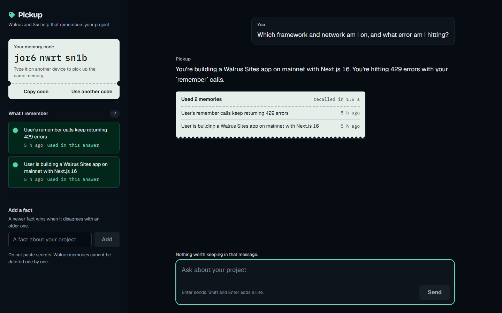

# Pickup

A chatbot for Walrus and Sui builders that remembers your project. Tell it your stack, an error, or a
decision once. Open it in another browser or on another device, enter your memory code, and it already
knows.

Built for Walrus Sessions 8, "Chatbots That Remember," by Mustapha Fadhlullah, independent security
researcher.



## What it does

Pickup is a streaming chat app. Before every answer it looks up what it already knows about you in
Walrus Memory. After every answer it saves anything worth keeping. Under each reply, a receipt such as
"Used 2 memories" lists the exact memories that shaped the answer and how old each one is.

There are no accounts. A random 12-character memory code, created on your first visit, is the only
identity. Typing the same code elsewhere opens the same memory.

## How Walrus Memory is used

Pickup uses `@mysten-incubation/memwal` 0.1.8 with the managed relayer
(`https://relayer.memory.walrus.xyz`) on mainnet. There is no mock in the path.

| Step | What happens |
|---|---|
| Namespace | One relayer account. Each memory code maps to its own namespace, `pickup-<code>`, so users cannot see each other's memories. |
| Recall | Before each answer the server calls `recall({ query, limit: 5, namespace, sort: "recent" })` with an 8-second timeout. Results go into the system prompt, newest first, with their age. If recall fails or times out, Pickup still answers and says it answered without memory. |
| Save | After the reply is on screen, the browser calls `/api/save`, which runs the SDK's `analyzeAndWait` so the Walrus Memory fact extractor picks what to keep. The UI shows "Saving to Walrus," then "Saved." |
| Add a fact | The "Add a fact" box calls `rememberAndWait` and stores the text as written. |

Design decisions that come from running against mainnet:

- **Saves never block the chat.** A mainnet write took 36 seconds in testing, so the save runs after the reply.
- **Not every message is written.** Short chit-chat, questions that state nothing about the user, and empty text are skipped. Text over 12 KB is trimmed, because the relayer silently drops turns over 16 KB (upstream issue #1037).
- **Writes are queued per namespace**, one at a time, to stay inside the relayer's rate limit.
- **Just-saved facts are recallable immediately.** The relayer needs a short indexing window after a write finishes, so the browser sends recent facts with the next message and the server merges them in.
- **Corrections win.** The model is told to trust the user over an older memory and say what changed.

## Evidence

Every figure below comes from a file in this repo.

| Check | Result | File |
|---|---|---|
| Mainnet smoke test | Relayer health 991 ms, one `rememberAndWait` 36.1 s, one `recall` 2.8 s, one Gemini call 959 ms at $0.0000046 | `evidence/p0.json` |
| Cross-session journey | A fact told in session A is recalled in a new session with no chat history. A different code sees nothing. A hand-added correction is used in the next answer. | `evidence/p1-journey.json` |
| Rendered UI, headless Chrome | The journey at 8 widths (320 to 1920 px): no horizontal overflow, text contrast of 4.5:1 or better, no console errors | `evidence/ui/report.json` |
| Unit tests | Type check and 18 tests, no keys or network needed | `npm run verify` |

## Run it

Requires Node 22 or newer.

```bash
npm ci
cp .env.example .env.local   # OPENROUTER_API_KEY, MEMWAL_KEY, MEMWAL_ACCOUNT_ID
npm run smoke                # relayer health, one write and recall, one model call
npm run dev                  # http://localhost:3000
```

With keys set and the app built (`npm run build && npx next start -p 3200`):

```bash
E2E_BASE=http://localhost:3200 npm run journey   # mainnet journey, writes evidence/p1-journey.json
node scripts/ui-screens.mjs                      # screenshots at 8 widths
node scripts/ui-drive.mjs                        # full journey through the rendered page
```

## Limits

- **The memory code is the only key.** Anyone with the code can read that memory, and a lost code cannot be recovered.
- **No deletion.** SDK 0.1.8 has no delete method, and the relayer's `forget` route only drops the search index, not the stored blob. Do not paste secrets.
- **The fact extractor is the stock Walrus Memory one.** It decides what is durable, and Pickup does not control that.
- **Writes are slow.** Expect 20 to 40 seconds on mainnet before a new memory is saved.

## Stack

Next.js (App Router), React, TypeScript, CSS Modules with design tokens, Motion for React, and
Gemini 2.5 Flash through OpenRouter with the response streamed to the browser.

## Related security research

While building on the SDK I found and reproduced two access-control defects in its host repo,
`MystenLabs/MemWal`. They are separate from Pickup. The write-up, proof of concept and a verified fix
are in [`bug-bounty/`](bug-bounty/).
